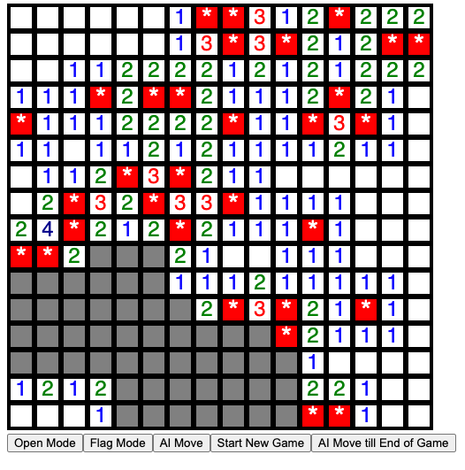

# Minesweeper Documentation

The classic Minesweeper game in Haskell.

The command `stack run` builds and runs the project. All dependencies should be
installed and the GUI will be served at `http://127.0.0.1:8023/`.

## Design

I decided to represent the game with the `Puzzle` record type below

```haskell
import Data.Array(Array)

data State = Open | Closed
data Square = Square
    { state :: State
    , isFlagged :: Bool
    , neighbourMinesCount :: Int
    , isSolverFlagged :: Bool
    , isSolverSafe :: Bool
    }

type Index = (Int, Int)
type Board = Array Index Square
data Puzzle = Puzzle
    { board :: Board
    , mines :: HashSet Index
    }
```

No puzzle is created until the first play, this is to avoid moving the mine to a different position due to the player choosing a spot that was a mine as it is impossible to lose on the first turn.

The `Data.Array` data structure was chosen because I wanted to easily modify it efficiently and a linked list was not the best choice for this. I could have opted for `Vector` described as a more efficient array but `Array` is efficient enough and I preferred the structure of using a 2d array rather than performing extra calculations due to the 1d nature of vector.
Initially, I also had `isMine` as a field in `Square` but decided against it to make it impossible for a solver to peek and use this information to aid in solving the game.
The `isSolverFlagged` and `isSolverSafe` fields are used by the solver to mark squares as mine or safe and can easily use this information in a subsequent play. This eliminates the need to solve it unnecessarily, thereby improving efficiency. Another benefit is seperation from the user toggling the flag. This has absolutely no effect on the solver.

Initially, my algorithm for the solver was to

1. flag all neighbours of squares where the square is opened and have a number equal to the number of closed neighbours.
2. find if possible and play in a trivially open square where there exists a neighbouring index (i, j) that
   has a `neighbourMinesCount` = the number of its neighbours that have been flagged by the solver.
3. if no trivially open flags are found, randomly select a closed square and play there.

The current solver maintains 1 and 2 above but after that, it checks to see if there is a square that the solver has marked safe and plays there, else, it calls the `CSPSolver.` The constraint satisfaction problem is defined as the following,

1. Variables are all unflagged neighbours of numbered squares with a domain of {0, 1}, where 0 represents safe and 1 represents a mine.
2. Constraints are the sum of variables of a numbered square must equal the number in the numbered square. N-ary (> 2 variables) constraints are binarized using the sum-variable method. I chose to represent the constraints using the data type below

```haskell
type IndexVarValue = Int
type SumVarValue = [IndexVarValue]
-- IndexVar index is the potential mine / safe square,
-- SumVar index is the index of a numbered square involved in a k-ary constraint.
-- These are just convenient unique variable names.
data Variable = IndexVar Index | SumVar Index
    deriving (Eq, Show)
type Value = Either IndexVarValue SumVarValue
data Constraint = Unary Variable Int (SumVarValue -> Bool)
| Binary Variable Variable (Value -> Value -> Bool)
```

The Unary Constraint is only used for sum variables. They are immediately converted to domains. For example, if we have the following 3-ary constraint,

```bash
X + Y + Z = 3
This becomes,
sum S = 3
X = S[0]
Y = S[1]
Z = S[2]
```

The domain for S initially would be all 8 combinations of (a, b, c) such that dom a, b, c = {0, 1} but this is immediately reduced to only pairs that satisfy X+Y+Z = 3. Hence, only binary constraints are passed into the solver.
This is nice because the algorithm for maintaining arc-consistency (AC-3) works on only binary constraints. Other heuristics were implemented for ordering the variables and values in the domains. The minimum remaining variable heuristic was used for ordering variables with the degree heuristic used to break ties and the least constrained value heuristic used to order the domain values of a variable.
squares that are mines in all solutions are flagged, and squares that are safe in all solutions are marked safe. There is probably a subtle bug that causes hanging sometimes that I did not have time to identify. I tested with the cli that it is able to solve most intermediate boards completely. A key observation when it fails is when at the start only one square is opened. To maximise that multiple squares are opened at the start, the solver always starts at the bottom left.

I opted not to use all closed squares as an optimisation. Which makes it slightly suboptimal but fast.
I found this idea from [Stanford Poster](https://web.stanford.edu/class/archive/cs/cs221/cs221.1192/2018/restricted/posters/thowarth/poster.pdf).

I implemented a cli version first that can be uncommented (GUI part has to be commented to avoid errors). This allowed me to perform manual tests quickly.

For the GUI, the default mode is opening a square, to flag a square, the "Flag Mode" button has to be clicked. I use a canvas to represent the board and convert between a position on the canvas and an index in the board by performing calculations on the size of the board and canvas and adjusting by 1 because I used 1-indexing. In hindsight, I could have easily used 0 but this was easily resolved. The "AI Move" and "AI Move till End of Game" buttons are used to play one AI move and let the AI play until the game ends respectively. The squares flagged by the AI have a \* in them while the user flagged squares are just filled with red for differentiation.
It is also possible to start a new game by clicking the "Start New Game" button.
I used IORef to maintain key variables for controlling the behaviour. This choice was to facilitate ease of development.
Here is a picture that shows the board.



